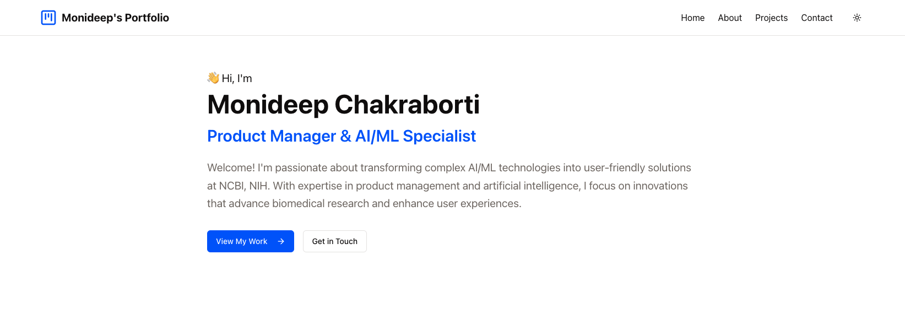
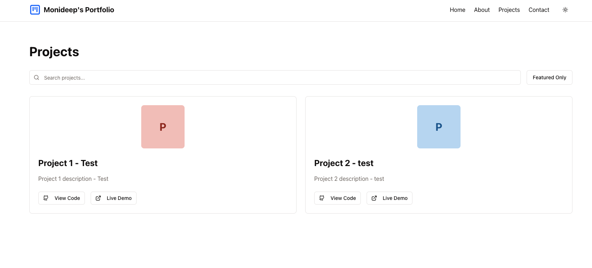

*Last Updated: April 17, 2025*

# Personal Portfolio Website

## Links to Personal Portfolio Website and PRD
- [Personal Website](https://personal-portfolio-monideepchakrab.replit.app/)
- [PRD](docs/PRD.md)

## UI Showcase

### Main Pages

*Homepage with modern, responsive design*


*About page showcasing professional experience and skills*


*Projects showcase with search and filtering capabilities*


*Contact form with validation*


*Dark mode for better user experience*

### Admin Interface

*Content Management System for Projects*


*Analytics Dashboard with traffic insights*

## Project Overview
A modern, responsive personal portfolio management system designed for seamless project showcase and administration.

### Phases & Feature Development

#### Phase 1: Initial Setup (✅ Completed) – March 12, 2025

#### Core Website Structure
- Responsive navigation bar with theme toggle
- Home page with hero section
- Projects showcase page
- About page with skills and experience sections
- Contact form with database storage
- Footer with social links

#### Design & UI Improvements
- Professional and clean design
- Responsive layout for all screen sizes
- Dark/light theme support with persistent toggle
- Smooth animations and transitions using Framer Motion
- Consistent typography and spacing

#### Technical Features
- Contact Form Database (PostgreSQL integration, API endpoint, validation with Zod)
- Component Library (Reusable UI components using shadcn/ui)
- Functional Status: Navigation, theme switching, contact form, responsive design, project showcase, and about page are implemented.

#### Phase 2: Content & Polish (✅ Completed) – March 20, 2025
- Resume Section: Successfully integrated resume content into the About page with clear section demarcation
- Home Page Enhancement: Improved layout and content presentation
- Projects Section Update: Projects page "Coming Soon" update completed.

#### Phase 3: Dynamic Project Uploads (✅ Completed) – March 25, 2025
- Project Management: Implemented full CRUD operations for project management
- Admin Content Control: Added secure admin interface for project management
- Project Filtering & Search: Implemented search functionality and featured project filter
- Database Integration: Successfully integrated PostgreSQL for project storage
- Protected Routes: Implemented authentication for admin features

#### Phase 4: Content Management & Analytics (✅ Completed) – March 26, 2025
- Enhanced Project Management:
  - Project categorization with predefined categories
  - Tagging system for better organization
  - Draft/published status for content management
- Content Preview System:
  - Real-time project preview functionality
  - Visual representation of project patterns
  - Preview of categories, tags, and links
- Analytics Implementation:
  - Page view tracking across site pages
  - Session-based analytics with visitor tracking
  - Interactive admin analytics dashboard
  - Real-time traffic monitoring
  - Data visualization with charts
  - Secure analytics access
- Email notification service
- Content Management System (CMS)
- Advanced search with filters and tags
- Image Upload: Implemented secure image upload functionality for projects
- Custom 404 Page: Enhanced UX with a professionally designed error page
- Performance Optimization: Improved Lighthouse scores (speed, SEO, accessibility)
- Accessibility Features: Added ARIA labels, keyboard navigation, and screen-reader support

#### Admin Access Instructions
To access the admin interface and analytics:
1. Navigate to `/admin/projects` for project management and `/admin/analytics` for analytics
2. Log in with admin credentials
3. Manage projects, view analytics, and access the admin dashboard

#### Features
- Enhanced Project Management:
  - Added project categorization with predefined categories (Web Development, Mobile App, API, etc.)
  - Implemented tagging system for better project organization
  - Added draft/published status for content management
- Content Preview System:
  - Real-time project preview functionality with live updates
  - Visual representation of project patterns
  - Preview of categories, tags, and links before publishing
- Analytics Implementation:
  - Page view tracking across all site pages
  - Session-based analytics with unique visitor tracking
  - Interactive admin analytics dashboard with visualizations
  - Real-time traffic monitoring with auto-refresh
  - Data visualization with charts (bar charts and pie charts)
  - Secure analytics data access for administrators
  - Added logout functionality in the analytics dashboard

#### Phase 5: Future Enhancements (🚧 Planned)

- Blog Platform: Implement a full-featured blog with rich text editing, categories, and commenting system
- Interactive Chatbot: Develop a personalized AI chatbot for enhanced user engagement and support
- Technical Documentation Hub: Create a comprehensive documentation section for technical write-ups and tutorials
- Newsletter System: Implement email subscription functionality with automated updates
- UI Enhancement: Refine visual elements with custom background imagery and improved typography

## Key Technologies
- Next.js frontend framework
- Tailwind CSS for styling
- React for component-based architecture
- PostgreSQL database integration
- Authentication and protected routes
- Admin interface for project management
- Flexible project image handling
- Responsive design with intuitive user experience

#### Technical Stack
- **Frontend**
  - Next.js
  - React
  - Tailwind CSS
  - Framer Motion
  - shadcn/ui components
  - React Query
  - Zod

- **Backend**
  - Express.js server
  - PostgreSQL database
  - Drizzle ORM
  - TypeScript

## 🛠️ Local Development Setup

### Prerequisites
- Node.js v20.18.1 or higher
- PostgreSQL database
- npm v10.x or higher

### Installation & Setup

1. Clone the repository
```bash
git clone https://github.com/monideep2255/personal_portfolio.git
cd personal_portfolio
```

2. Install dependencies
```bash
npm install
```

3. Set up environment variables by creating a `.env` file:
```env
DATABASE_URL=your_postgresql_database_url
ADMIN_USERNAME=your_admin_username
ADMIN_PASSWORD=your_admin_password
```

4. Initialize the database
```bash
npm run db:push
```

5. Start the development server
```bash
npm run dev
```

6. Access the application at [http://0.0.0.0:5000](http://0.0.0.0:5000) in your browser

The application will start in development mode with hot-reload enabled.

## 🚀 Deployment

#### Recommended: Deploy on Netlify (Production Ready)

The codebase is optimized for Netlify deployment with serverless functions and automatic scaling.

**Prerequisites:**
1. **Neon Database** (Free PostgreSQL hosting)
   - Create account at [neon.tech](https://neon.tech)
   - Create new project and copy connection string
   - Free tier: 3GB storage, always-available compute

2. **GitHub Repository**
   - Ensure your code is pushed to GitHub

**Deployment Steps:**

1. **Deploy to Netlify**
   - Go to [netlify.com](https://netlify.com) and create account
   - Click "Add new site" → "Import an existing project"
   - Connect your GitHub repository
   - Netlify auto-detects build settings from `netlify.toml`

2. **Environment Variables**
   Add these in Netlify Dashboard → Site settings → Environment variables:
   ```
   DATABASE_URL=your_neon_database_connection_string
   ADMIN_USERNAME=your_admin_username
   ADMIN_PASSWORD=your_admin_password
   EMAIL_USER=your_gmail_address
   EMAIL_PASSWORD=your_gmail_app_password
   ```

3. **Features Included**
   - Serverless API functions
   - Automatic HTTPS and CDN
   - Form handling and analytics
   - Admin dashboard with authentication
   - Contact form with email notifications

**Live Site:** Your portfolio will be accessible at `your-site-name.netlify.app`

**Free Tier Limits:**
- Netlify: 100GB bandwidth, 125K function requests/month
- Neon: 3GB storage, unlimited requests

#### Alternative Deployment Options

1. **Replit Deploy** (Development/Testing)
   - Click "Deploy" button in Replit workspace
   - Choose deployment type and configure
   - Live at `your-repl-name.replit.app`

2. **Render.com**
   - Connect GitHub repository
   - Set build: `npm run build`, start: `npm run start`
   - Configure environment variables

3. **Railway.app**
   - Connect GitHub repository
   - Auto-detects build settings
   - Configure environment variables
